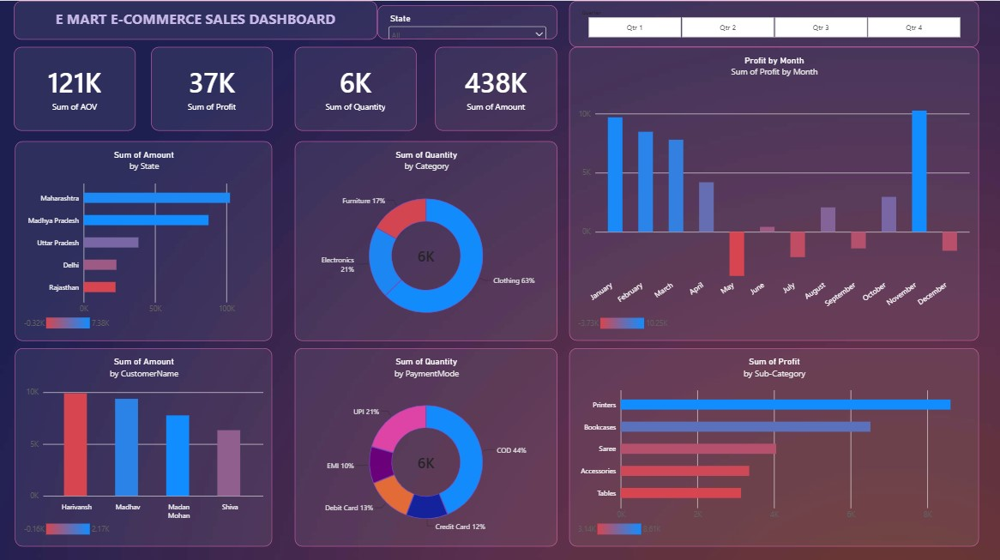

# E-Mart E-Commerce Sales Dashboard

An interactive Power BI dashboard analyzing E-Mart's e-commerce sales performance across states, product categories, customers, and payment modes, with quarter-by-quarter drill-down.

## Overview
This project combines order-level data (customer, location, date) with transaction-level details (amount, profit, quantity, category) to surface key business metrics — Average Order Value (AOV), total profit, quantity sold, and revenue — segmented by state, customer, product category, sub-category, and payment mode.

## Dataset
- **Orders.csv** — 500 orders with Order ID, Order Date, Customer Name, State, City
- **Details.csv** — 1,500 line items with Order ID, Amount, Profit, Quantity, Category, Sub-Category, Payment Mode

## Tools Used
- Power BI Desktop (data modeling, DAX, visualization)

## Key Insights
- Clothing is the dominant product category, consistently accounting for 60–66% of quantity sold across all quarters
- Maharashtra and Madhya Pradesh are the top revenue-generating states throughout the year
- Cash on Delivery (COD) is the most common payment method, at roughly 43–44% of all transactions
- Profit fluctuates significantly month to month, including a notable dip in Q3 (August–September) followed by a strong rebound in November
- The dashboard supports interactive filtering by state and quarter, allowing drill-down into regional and seasonal performance

## Dashboard Features
- Card visuals for AOV, Profit, Quantity, and Amount
- Sales by State, Category, and Sub-Category
- Payment mode breakdown
- Monthly profit trend
- Quarter and state slicers for interactive filtering
